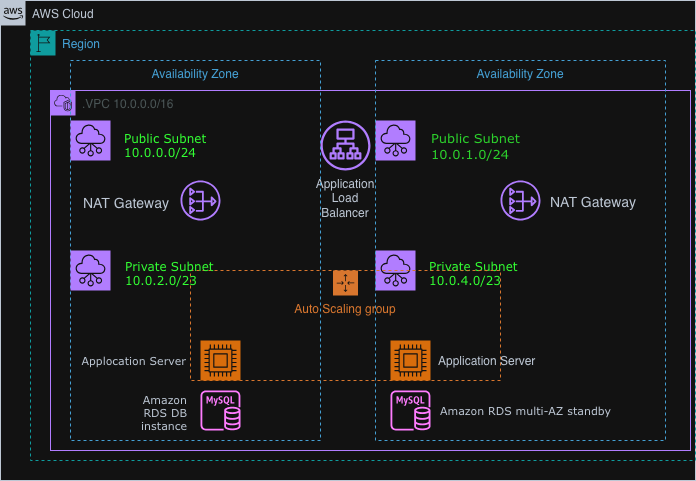

# Highly Available Web App on AWS (ALB + Auto Scaling + Multi-AZ VPC)

Portfolio Project by **CloudWthAlex**

## Overview
This project demonstrates how I transformed a **single EC2 web server** into a **highly available (HA) web application** on AWS by using **Multi-AZ networking**, an **Application Load Balancer (ALB)**, and an **Auto Scaling Group (ASG)**.

The goal is to keep the application running even if **one EC2 instance fails** (and optionally even if one Availability Zone fails).

---

## The Problem
A web application running on **one EC2 instance** has a major weakness:

- If the EC2 instance crashes, gets terminated, or becomes unhealthy → the website goes down.
- There is no automatic failover.
- There is no automatic replacement server.
- Availability is limited to a single point of failure.

In real businesses, this can cause downtime, lost revenue, and poor user experience.

---

## The Solution (High Availability Design)
I built a **Multi-AZ architecture** with these key components:

### 1) Network Foundation (VPC)
- Created / inspected a **VPC (10.0.0.0/16)**
- Deployed **two Availability Zones**
- In each AZ:
  - **Public Subnet** (for internet-facing components)
  - **Private Subnet** (for application servers and database)

### 2) Internet Entry + Traffic Distribution (ALB)
- Created an **Application Load Balancer** across **two public subnets**
- Configured **listeners** (HTTP/80 + HTTPS/443)
- Created a **Target Group** for the application servers
- Enabled health checks so the ALB only routes traffic to **healthy targets**

### 3) Self-Healing Compute Layer (Auto Scaling)
- Created an **AMI** from the original web server (golden image)
- Built a **Launch Template** with:
  - AMI
  - instance type (t2.micro)
  - security group
  - IAM role
  - user-data bootstrap script (install Apache/PHP + deploy app)
- Created an **Auto Scaling Group** across **two private subnets (Multi-AZ)**
- Set desired capacity to **2 instances** to maintain HA

### 4) Security (Three-Tier Security Groups)
I applied least-privilege networking using Security Groups:

- **Load Balancer SG**: allows inbound HTTP/HTTPS from the internet
- **App Server SG**: allows inbound HTTP only from the Load Balancer SG
- **DB SG**: allows inbound MySQL (3306) only from the App Server SG

This enforces a clean **three-tier architecture**:
Internet → ALB → App Servers → Database

---

## Architecture Diagram

---

## Step-by-Step Implementation (What I Did)

### Task 1 — Inspect the VPC
1. Confirm VPC CIDR: `10.0.0.0/16`
2. Confirm public subnets route `0.0.0.0/0` → **Internet Gateway**
3. Confirm private subnets use **NAT Gateway** for outbound internet (if needed)
4. Review initial Security Groups and RDS placement

### Task 2 — Create the Application Load Balancer
1. Create ALB named `Inventory-LB`
2. Place ALB in **Public Subnet 1 + Public Subnet 2**
3. Create Security Group `Inventory-LB`
   - inbound HTTP from `0.0.0.0/0`
   - inbound HTTPS from `0.0.0.0/0`
4. Create Target Group `Inventory-App`
   - target type: Instances
   - health check tuned (interval 10s, healthy threshold 2)
5. Attach Target Group to ALB Listener (HTTP:80 → forward to target group)

### Task 3 — Create Auto Scaling Group
1. Create AMI from `Web Server 1` → `Web Server AMI`
2. Create Launch Template `Inventory-LT`
   - AMI: Web Server AMI
   - instance type: t2.micro
   - SG: Inventory-App
   - IAM Role: Inventory-App-Role
   - CloudWatch detailed monitoring: enabled
   - User Data: bootstrap script installs web stack + deploys app
3. Create Auto Scaling Group `Inventory-ASG`
   - VPC: Lab VPC
   - subnets: Private Subnet 1 + Private Subnet 2
   - attach to target group: `Inventory-App`
   - desired/min/max: 2/2/2

### Task 4 — Update Security Groups (Hardening)
1. App SG inbound: HTTP only from **Inventory-LB SG**
2. DB SG inbound: MySQL 3306 only from **Inventory-App SG**
3. Confirm each tier only accepts traffic from the tier above

### Task 5 — Test Application
1. Get ALB DNS name
2. Open DNS in browser
3. Refresh multiple times to observe traffic going to different instances/AZs

### Task 6 — Prove High Availability
1. Terminate one EC2 instance in the ASG
2. Confirm the website still loads (ALB routes to healthy instance)
3. Confirm ASG launches a replacement instance automatically
4. Confirm target group returns to 2 healthy targets

---

## The Result
✅ The application became highly available and self-healing:

- **No single EC2 failure can take down the app**
- ALB health checks stop routing to unhealthy instances
- Auto Scaling automatically replaces failed instances
- App servers stay private (not directly exposed to the internet)
- Security groups enforce strict tier-to-tier access
- Multi-AZ design improves resilience

---

## AWS Services Used
- Amazon VPC (public/private subnets, route tables, IGW, NAT)
- Application Load Balancer (ALB)
- Target Groups + Health Checks
- EC2 Launch Template
- EC2 Auto Scaling Group (ASG)
- Security Groups
- (Optional) Amazon RDS Multi-AZ standby
- (Optional) Highly available NAT Gateway (per AZ)

---

## What I Learned
- How Multi-AZ design prevents single points of failure
- How ALB listener + target group routing works
- How Auto Scaling maintains desired capacity automatically
- How to enforce a three-tier security model using SG references
- How to validate high availability with real failure testing

---

## Author
**CloudWthAlex**  
GitHub: https://github.com/CloudWthAlex
